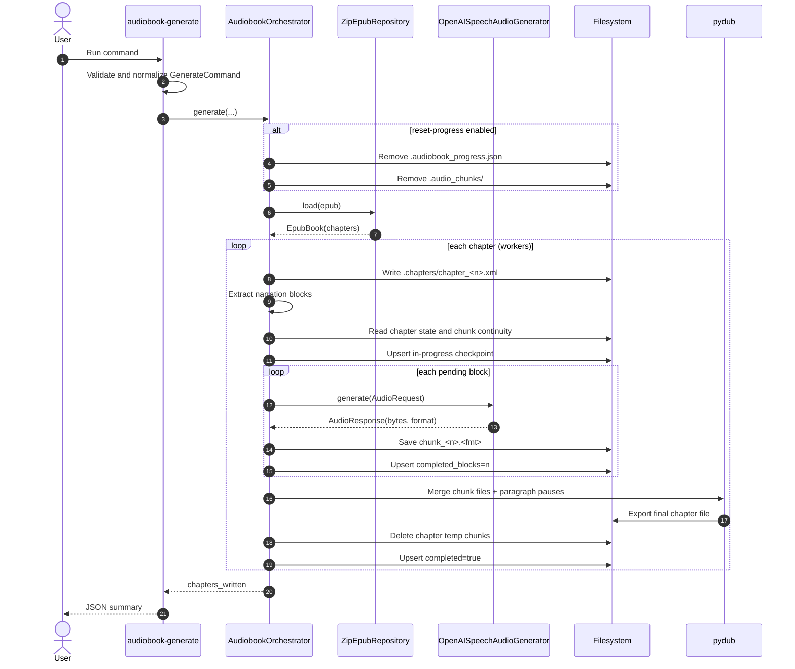

# audiobook-generator-cli

`audiobook-generator` builds chapter-level audiobook files from an EPUB by applying a staged pipeline:

1. extract narratable text blocks from XHTML,
2. synthesize per-block audio through an OpenAI-compatible TTS API,
3. merge chunk files into final chapter audio with natural pauses,
4. persist resume checkpoints so interrupted runs can restart safely.

---

## Core Features

- EPUB chapter extraction (`.xhtml/.html/.htm`) with robust text normalization.
- Narration block filtering that skips punctuation-only placeholders.
- Heading-aware narration prompts (headings and paragraphs can use different tone instructions).
- Chunk spooling to disk (`.audio_chunks`) to reduce memory footprint.
- Idempotent resume via `.audiobook_progress.json` at paragraph granularity.
- Parallel chapter processing with deterministic per-chapter progress checkpointing.
- Output per chapter in `wav` (default) or `mp3`.

---

## Architecture And Patterns

The codebase is organized by clean architecture layers:

- `domain`: immutable models and ports (`Protocol` abstractions).
- `application`: orchestration use cases (`AudiobookOrchestrator`).
- `infrastructure`: concrete adapters (EPUB zip repository, OpenAI-speech generator, logging).

Patterns applied:

- **Facade**: `AudiobookOrchestrator.generate(...)` as single application entrypoint.
- **Strategy via Ports**: `AudioGeneratorPort` and `EpubRepositoryPort` decouple orchestration from implementations.
- **Command Object**: CLI command normalization into `GenerateCommand` before side effects.
- **Pipeline Stages**: extraction -> synthesis -> merge/finalization.
- **Checkpointing**: `ProgressIndex` acts as a lightweight persistence component for resume logic.

---

## Project Structure

- `src/audiobook_generator_cli/cli.py`: CLI parsing, validation, command assembly.
- `src/audiobook_generator_cli/application/services/audiobook_orchestrator.py`: chapter pipeline orchestration.
- `src/audiobook_generator_cli/domain/models.py`: immutable request/settings/book models.
- `src/audiobook_generator_cli/domain/ports.py`: domain contracts.
- `src/audiobook_generator_cli/infrastructure/epub/epub_repository.py`: ZIP EPUB adapter.
- `src/audiobook_generator_cli/infrastructure/llm/openai_speech_audio_generator.py`: OpenAI speech adapter.
- `tests/unit/`: behavior tests for extraction, orchestrator, and TTS adapter.

---

## End-to-End Pipeline

### 1) Pre-processing (text extraction and cleanup)

From chapter XHTML:

- parse XML tree,
- select narratable tags: `h1..h6`, `p`, `li`, `blockquote`, `dd`, `dt`, `figcaption`, `td`, `th`,
- extract text with `itertext()` to preserve inline emphasis content,
- normalize spaces and punctuation spacing,
- append terminal punctuation to headings when missing,
- skip blocks without spoken content (e.g. only `.`).

### 2) Processing (TTS synthesis)

For each chapter block:

- build narration instructions:
    - base instruction: stable tone/volume + punctuation-aware pacing,
    - heading instruction: calm heading reading,
    - optional user overrides from `--heading-tone` / `--paragraph-tone`.
- send chunk request to OpenAI-compatible `/v1/audio/speech`.
- save returned chunk as `chunk_<n>.<fmt>` inside `.audio_chunks/<chapter_id>/`.
- update progress index with `completed_blocks`.

### 3) Post-processing (merge and finalize)

After all chunks are available for a chapter:

- load chunk files in index order,
- merge with `pydub`,
- insert silence (`--paragraph-pause-ms`) between consecutive paragraph-like blocks,
- export final chapter file in selected format,
- remove temp chapter chunk directory,
- mark chapter as completed in progress index.

---

## Resume / Idempotency

Output directory metadata:

- `.chapters/chapter_<n>.xml`: chapter snapshots used for debugging.
- `.audio_chunks/chapter_<index>_<stem>/chunk_<n>.<fmt>`: per-block audio chunks.
- `.audiobook_progress.json`: chapter completion + paragraph cursor.

Resume behavior:

- completed chapter + existing final output => skipped,
- incomplete chapter => resumes from first missing paragraph,
- `--reset-progress` clears index and `.audio_chunks` for a fresh run.

---

## CLI Flags

| Flag                                   | Default                 | Description                                |
|----------------------------------------|-------------------------|--------------------------------------------|
| `--in`                                 | required                | Input EPUB file path                       |
| `--out`                                | `<in_stem>_audiobook/`  | Output directory                           |
| `--voice-model`                        | required                | TTS model name                             |
| `--voice-backend`                      | `openai-speech`         | TTS backend selector                       |
| `--voice-base-url`                     | `http://localhost:8000` | TTS API base URL                           |
| `--voice`                              | `alloy`                 | Voice id sent to backend                   |
| `--heading-tone`                       | `""`                    | Additional style for heading blocks        |
| `--paragraph-tone`                     | `""`                    | Additional style for paragraph-like blocks |
| `--paragraph-pause-ms`                 | `700`                   | Silence between paragraph blocks           |
| `--spool-temp-chunks`                  | `true`                  | Keep chunk files before merge              |
| `--output-format` / `--chapter-format` | `wav`                   | Final chapter format (`wav`, `mp3`)        |
| `--workers`                            | `1`                     | Parallel chapter workers                   |
| `--stream`                             | `false`                 | Use streaming responses from backend       |
| `--reset-progress`                     | `false`                 | Clear checkpoint and temp chunks           |
| `--log-level`                          | `INFO`                  | Logging level (`INFO`, `DEBUG`)            |

---

## Sequence Diagram



---

## Install (dev)

```bash
python -m venv .venv
source .venv/bin/activate
pip install -U pip
pip install -e ".[dev]"
```

## Quick Start

```bash
audiobook-generate \
  --in ./resources/input/sample1.epub \
  --out ./resources/output/sample1_audiobook \
  --voice-model mlx-community/Voxtral-4B-TTS-2603-mlx-4bit \
  --voice-backend openai-speech \
  --voice gold \
  --voice-base-url http://localhost:8000 \
  --workers 1 \
  --output-format wav
```

## Testing

```bash
pytest -q tests/unit
```

---

## Operational Notes

- Use `--workers 1` when debugging resume behavior for deterministic logs.
- Use `--log-level DEBUG` to inspect per-chunk progress and payload flow.
- The backend must expose an OpenAI-compatible speech endpoint (`POST /v1/audio/speech`).
- `pydub` handles merges; for robust `mp3` export install `ffmpeg` on your system.

