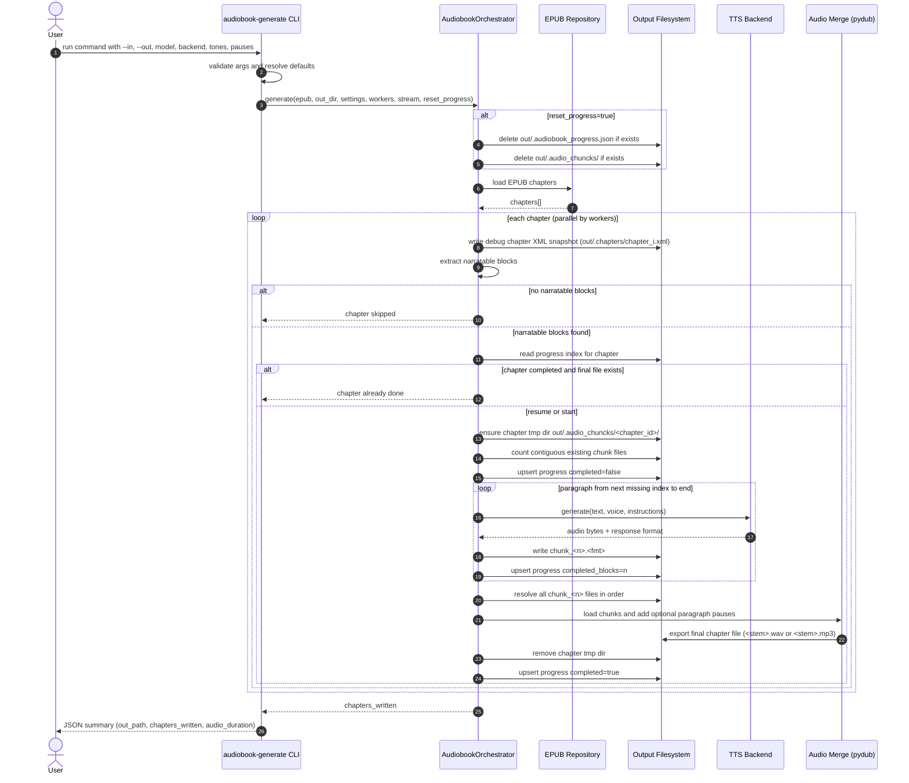

# audiobook-generator-cli

Generate a per-chapter audiobook from an EPUB by extracting narratable XHTML blocks, generating TTS per block, and
merging to final chapter audio files.

## What This Tool Does

- Loads an EPUB and iterates chapter XHTML documents.
- Extracts narratable blocks (`h1..h6`, `p`, `li`, `blockquote`, `dd`, `dt`, `figcaption`, `td`, `th`).
- Skips punctuation-only placeholders such as `<p class="whitespace">.</p>`.
- Calls an OpenAI-compatible TTS backend per block (`openai-speech`).
- Supports different style instructions for headings vs paragraph-like content.
- Inserts configurable pauses between consecutive paragraph blocks.
- Writes one final audio file per chapter (`wav` by default, optional `mp3`).
- Tracks progress on disk and resumes after interruption at paragraph granularity.

## Why These Design Choices

- **Block-based TTS**: avoids giant prompt payloads, improves retry boundaries, preserves chapter structure.
- **Heading punctuation normalization**: headings get terminal punctuation when missing, so TTS prosody sounds complete.
- **Paragraph pause control**: gives more natural pacing without forcing model-level silence tokens.
- **Disk chunk spooling**: each generated paragraph audio is written to disk before merge, reducing RAM pressure on long
  chapters.
- **Idempotent progress index**: restart-safe workflow, especially useful with long books and unstable local model
  servers.

## Install (dev)

```bash
python -m venv .venv
source .venv/bin/activate
pip install -U pip
pip install -e ".[dev]"
```

## Requirements

- Python 3.9+
- TTS backend: `openai-speech` (OpenAI-compatible `/v1/audio/speech` server)

## Quick Start

### OpenAI-compatible backend

```bash
audiobook-generate \
  --in ./sample1.italiano.epub \
  --out ./sample1_audiobook/ \
  --voice-model mlx-community/Voxtral-4B-TTS-2603-mlx-4bit \
  --voice-backend openai-speech \
  --voice gold \
  --voice-base-url http://localhost:8000 \
  --output-format wav
```

## Resume / Idempotency Model

The output directory stores:

- `.chapters/chapter_<n>.xml`: extracted source chapter XML snapshots.
- `.audio_chuncks/<chapter_id>/chunk_1.<fmt> ...`: paragraph-level generated audio chunks.
- `.audiobook_progress.json`: checkpoint index with `completed_blocks` per chapter.

On restart with the same `--out` folder:

- Completed chapters are skipped.
- Incomplete chapters resume from the first missing paragraph chunk.
- Final merge runs once all paragraph chunks exist.

Use `--reset-progress` to clear both `.audiobook_progress.json` and `.audio_chuncks/` before a fresh run.

## Flags

| Flag                                   | Default                | Description                                                |
|----------------------------------------|------------------------|------------------------------------------------------------|
| `--in`                                 | *(required)*           | Input EPUB path.                                           |
| `--out`                                | `<in_stem>_audiobook/` | Output directory for chapter files and progress artifacts. |
| `--voice-model`                        | *(required)*           | TTS model id.                                              |
| `--voice-backend`                      | `openai-speech`        | Only `openai-speech` is supported.                         |
| `--voice-base-url`                     | backend-specific       | Base URL of selected backend.                              |
| `--voice`                              | `alloy`                | Voice id forwarded to backend.                             |
| `--heading-tone`                       | `""`                   | Style instructions only for heading blocks.                |
| `--paragraph-tone`                     | `""`                   | Style instructions for paragraph/list-like blocks.         |
| `--paragraph-pause-ms`                 | `700`                  | Silence between consecutive paragraph blocks.              |
| `--spool-temp-chunks`                  | `true`                 | Keep per-paragraph chunk files on disk before merge.       |
| `--output-format` / `--chapter-format` | `wav`                  | Final chapter format (`wav` or `mp3`).                     |
| `--workers`                            | `1`                    | Parallel chapter workers.                                  |
| `--stream`                             | `false`                | Request streaming from backend where supported.            |
| `--reset-progress`                     | `false`                | Clear previous progress and temp chunks in `--out`.        |
| `--log-level`                          | `INFO`                 | `INFO` or `DEBUG`.                                         |

## Narration Extraction Rules

- Inline formatting text is preserved via `itertext()` (`<em>`, `<span>`, etc.).
- Only configured narratable tags are considered.
- Blocks without alphanumeric content are skipped.
- Headings receive trailing punctuation when absent to improve spoken cadence.
- Extra spaces before punctuation are normalized (`"word !" -> "word!"`) for cleaner prosody.

## Default Narration Prompt Tuning

Even without custom tone flags, the generator now sends baseline style instructions to the TTS backend:

- keep a consistent tone and stable volume across the full passage,
- respect punctuation for natural pauses,
- read headings calmly (no shouting / over-emphasis).

Your custom `--heading-tone` and `--paragraph-tone` are appended on top of these defaults.

## Detailed Sequence Diagram



## Logging and Exit Codes

- Default logging: `INFO`
- Debug logging: `--log-level DEBUG`
- Exit codes:
    - `0`: success
    - `1`: fatal error

