# Audiobook Generator CLI — Architecture & Flow Documentation

## Overview

`audiobook-generator-cli` is a CLI tool that converts EPUB books into per-chapter audiobook files
using a local OpenAI-compatible text-to-speech backend. It is structured around a clean
hexagonal/ports-and-adapters architecture with three declared layers: **domain**, **application**,
and **infrastructure**.

The domain layer contains pure data models, the error hierarchy, port interfaces, and the single
named constant that pins the default TTS base URL. It has no external dependencies of any kind. The
application layer holds the orchestration logic and all application-level utilities — text
extraction, audio merging, progress checkpointing, and the per-chapter synthesis loop — depending
only on domain ports rather than concrete implementations. The infrastructure layer provides the
concrete adapters: ZIP-based EPUB I/O and the OpenAI-speech TTS HTTP client. The composition root
(`main.py`) wires all adapters together and injects them into the CLI handler.

This architecture was chosen over a monolithic approach because the audiobook pipeline has two
clearly separate concerns that change independently: EPUB parsing logic changes when new EPUB
variants need support, and TTS integration changes when the backend API changes. Keeping these
concerns in separate adapters behind ports means either can be replaced or extended without touching
the orchestrator or the other adapter.

---

## Layer Map

```
main.py  — composition root: instantiates infrastructure, injects into CLI handler
  └── cli.py  — accepts injected AudiobookOrchestrator, imports no infrastructure
        └── application/services/audiobook_orchestrator.py
              ├── application/models.py       (NarrationBlock, ChapterJob, PreparedChapter)
              ├── application/progress.py     (ProgressIndex — frozen dataclass + JSON persistence)
              ├── application/merge.py        (merge_temp_chunks, _chunk_path_for_index)
              ├── application/text.py         (extract_narration_blocks, instruction builder)
              ├── domain/models.py            (AudioSettings, AudioRequest, AudioResponse, ChapterDocument)
              ├── domain/ports.py             (EpubRepositoryPort, AudioGeneratorPort, EpubBook)
              └── infrastructure/logging/logger_factory.py  (cross-cutting concern)

domain/           — no imports from application or infrastructure
application/      — imports from domain only (plus logging cross-cut)
infrastructure/   — imports from domain only
main.py           — imports from all layers (composition root)
```

---

## 1. High-Level Audiobook Generation Flow

This flow describes the full end-to-end journey of a generation run from the user entering the
command on the terminal to the final per-chapter WAV (or MP3) files landing on disk. The CLI
validates and normalises all arguments, then passes control to the orchestrator. The orchestrator
loads the EPUB, initialises the progress checkpoint index, and submits every chapter to a thread
pool. Each chapter is extracted, synthesised paragraph-by-paragraph, merged into a single audio
file, and checkpointed. When the thread pool finishes the CLI prints a JSON summary and exits.

The thread pool operates at chapter granularity rather than paragraph granularity because chapter
files must be assembled as a single merged audio segment. A chapter with N paragraphs must complete
all N synthesis calls before the merge step, making the chapter the natural unit of work. Paragraph
synthesis within a chapter is sequential to allow correct resume index management.

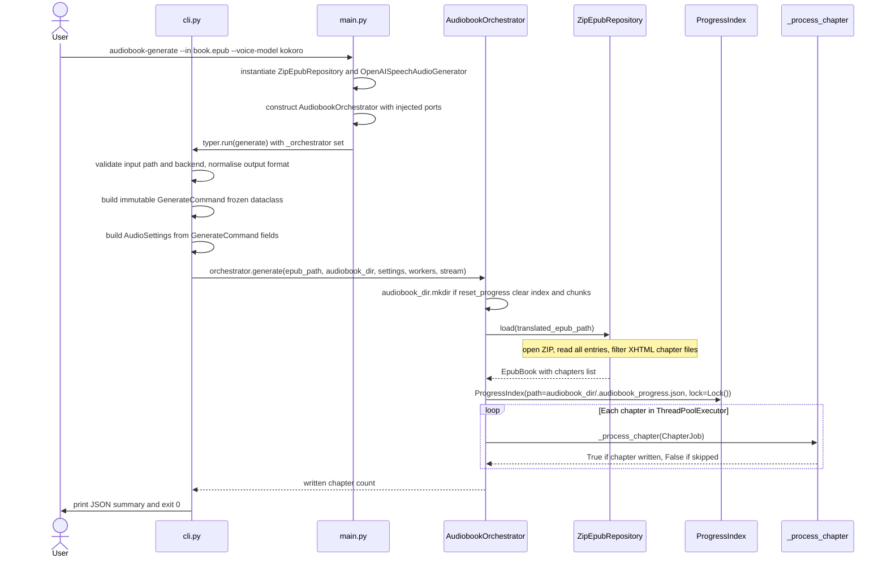

**Step-by-step walkthrough:**

- **`User → Main`** — The user runs `audiobook-generate` with at minimum `--in` and `--voice-model`.
  All other arguments have sensible defaults. `main.py` is the entry point registered in
  `pyproject.toml` under `[project.scripts]`.
- **`Main → Main: instantiate ZipEpubRepository and OpenAISpeechAudioGenerator`** — The composition
  root creates both concrete infrastructure objects. `OpenAISpeechAudioGenerator` uses
  `_DEFAULT_TTS_BASE_URL` as its default; at this stage the CLI has not yet parsed `--voice-base-url`,
  so the default is applied later when the CLI calls `_resolve_tts_url`.
- **`Main → Main: construct AudiobookOrchestrator`** — The orchestrator receives both adapters typed
  as their respective port interfaces. After this point `main.py` has no further role; it calls
  `typer.run(cli_module.generate)` and Typer dispatches to the `generate` function.
- **`Main → CLI: typer.run`** — `cli_module._orchestrator` is set before `typer.run()` is called.
  Typer parses the remaining sys.argv arguments and calls `generate()` with typed parameters.
- **`CLI → CLI: validate and build GenerateCommand`** — `_validate_input_path` asserts the input
  file exists. `_validate_backend` asserts the backend name is in `_VOICE_BACKENDS`. Output format
  is normalised to lowercase. A `GenerateCommand` frozen dataclass captures all resolved values.
- **`CLI → CLI: build AudioSettings`** — `_build_audio_settings` maps the validated command fields
  into a domain `AudioSettings`. The `base_url` is set from `_resolve_tts_url(voice_base_url)`,
  which falls back to `_DEFAULT_TTS_BASE_URL` when the flag is empty.
- **`CLI → Orch: orchestrator.generate(...)`** — Control transfers entirely to the orchestrator.
  The CLI waits for the returned integer (chapters written) and the elapsed time.
- **`Orch → Repo: load(translated_epub_path)`** — The repository opens the EPUB ZIP and returns an
  `EpubBook`. All chapter filtering is done inside the repository; the orchestrator receives only the
  final list of `ChapterDocument` objects.
- **`Orch → Progress`** — A single `ProgressIndex` is created and shared across all chapter workers
  via the `ChapterJob`. Its `Lock` field serialises concurrent writes from the thread pool so that
  no two chapters corrupt the JSON checkpoint file simultaneously.
- **`Orch → ThreadPoolExecutor`** — All chapters are submitted as futures in a single generator
  expression. `as_completed` drives the collection loop. Chapters that return `True` increment the
  `written` counter; chapters that return `False` (empty chapter or already completed) do not.
- **`CLI → User`** — After the orchestrator returns, the CLI logs a structured INFO line and calls
  `_render_summary`, which prints a JSON object with `out_path`, `chapters_written`, and
  `audio_duration`. Then `typer.Exit(code=0)` exits cleanly.

---

## 2. Chapter Processing Flow

Every chapter goes through a five-step pipeline inside `_process_chapter`: the XHTML bytes are
written to a debug snapshot directory, narratable blocks are extracted, already-completed work is
detected and skipped, missing paragraph chunks are synthesised one at a time, and all chunks are
merged into the final chapter file. Each step is isolated into a dedicated private method so the
high-level flow is readable without inlining all the detail.

The checkpoint-before-and-after pattern around synthesis ensures that a crash mid-chapter leaves
only the chunks synthesised so far on disk. The next run reads the progress index and the chunk
files, picks the higher of the two as the resume cursor, and skips straight to the first unfinished
paragraph. This means each paragraph is synthesised at most once regardless of how many times the
process is restarted.

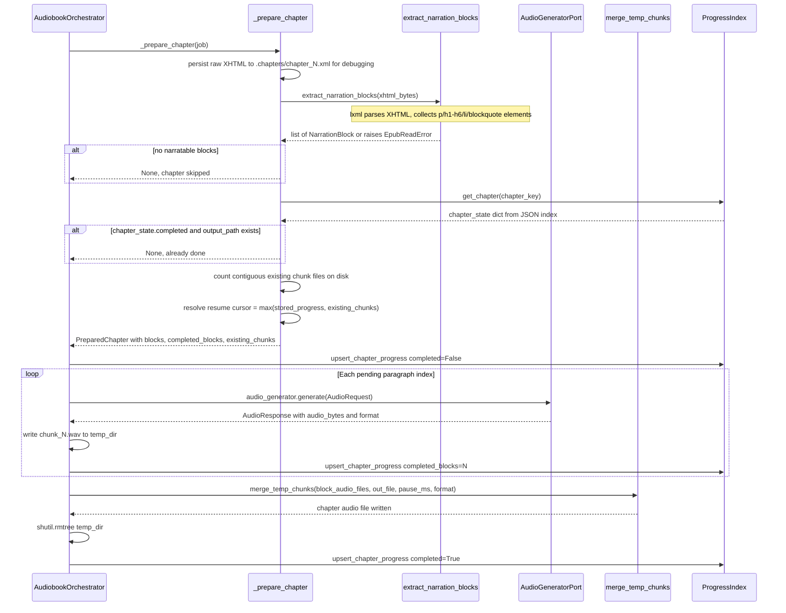

**Step-by-step walkthrough:**

- **`Orch → Prep: _prepare_chapter(job)`** — Receives the immutable `ChapterJob` which bundles the
  chapter document, output paths, settings, progress index, and worker flags into a single object.
- **`Prep: persist raw XHTML`** — The chapter's raw XHTML bytes are written to
  `<audiobook_dir>/.chapters/chapter_<N>.xml` before any parsing. This snapshot is valuable for
  diagnosing corrupt chapters: the raw bytes are available even if `extract_narration_blocks` raises.
- **`Prep → Text: extract_narration_blocks(xhtml_bytes)`** — Delegates to the application text
  module. Raises `EpubReadError` on malformed XHTML rather than returning an empty list, so corrupt
  chapters surface as failures rather than silent skips.
- **`Text → Prep: list of NarrationBlock`** — Each `NarrationBlock` carries the local tag name
  (e.g. `"p"`, `"h1"`) and the cleaned display text. The tag is needed later to decide whether to
  insert a paragraph pause before the next block.
- **`Prep: detect skip conditions`** — If the block list is empty (chapter has no narratable
  content) or the progress index marks the chapter as `completed` and the output file already exists
  on disk, `_prepare_chapter` returns `None`. The orchestrator treats `None` as a skip and does not
  increment the written counter.
- **`Prep: resolve resume cursor`** — `_count_contiguous_existing_chunks` counts how many
  `chunk_<N>.<ext>` files exist in the temp directory starting from index 1 without gaps. The resume
  cursor is the maximum of this count and the stored `completed_blocks` value from the index, so a
  crash that left chunk files but did not update the index is still recovered correctly.
- **`Prep → Orch: PreparedChapter`** — The immutable snapshot of all synthesis inputs is returned.
  No mutable state crosses the boundary between preparation and synthesis.
- **`Orch → Idx: initial checkpoint`** — Before any TTS call, the chapter is registered in the
  index with `completed=False`. If the process crashes before any synthesis, the next run can see
  that this chapter was in progress and reset its cursor correctly.
- **`Orch → TTS: audio_generator.generate(AudioRequest)`** — One request is sent per paragraph. The
  text is first passed through `_strip_inline_tags_for_tts` to remove any XML tag residue that the
  EPUB author may have left in the text nodes. Empty text after stripping is skipped without sending
  a TTS request.
- **`Orch: write chunk file`** — The audio bytes are written to
  `<temp_dir>/chunk_<N>.<format>`. The format is taken from `AudioResponse.format`, which mirrors
  the content-type returned by the TTS server.
- **`Orch → Idx: per-paragraph checkpoint`** — After each chunk is written to disk, the progress
  index is updated with the new `completed_blocks` count. This ensures the resume cursor advances
  atomically with the actual work.
- **`Orch → Merge: merge_temp_chunks(...)`** — Collects all chunk file paths in order, verifies that
  none are missing, and calls `merge_temp_chunks`. pydub loads each chunk, appends a silence segment
  between consecutive non-heading paragraph blocks, and exports the combined audio to the final
  output path.
- **`Orch: cleanup and final checkpoint`** — The temp directory is deleted via `shutil.rmtree`, then
  the progress index is updated with `completed=True`. The order matters: deleting temp files before
  marking complete means a crash between delete and checkpoint would cause a full re-merge on the
  next run, which is preferable to leaving orphaned temp files.

---

## 3. Text Extraction and Narration Block Building

`extract_narration_blocks` in `application/text.py` is responsible for turning raw XHTML bytes into
a list of `NarrationBlock` values that the synthesis loop can consume directly. The function
intentionally raises rather than returning an empty list on parse failure because the caller depends
on a correct block count for resume index management — an incorrect count would corrupt the
checkpoint state.

The multi-pass approach (parse once, collect narratable elements, compute cleaned text, filter
empties, then build blocks) is chosen over a single-pass streaming approach because it allows an
accurate `heading_period_appended` diagnostic count to be logged at the end, and because the
deduplicated `cleaned_by_elem` dict avoids computing `_normalise_block_text` twice for the period
append decision.

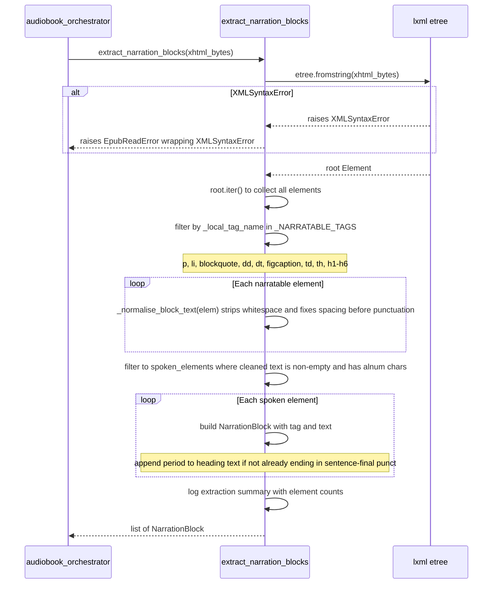

**Step-by-step walkthrough:**

- **`Caller → Text: extract_narration_blocks(xhtml_bytes)`** — The raw XHTML bytes from the EPUB
  ZIP entry are passed directly without any pre-processing. lxml handles the XML declaration and
  namespace prefixes internally.
- **`Text → lxml: etree.fromstring(xhtml_bytes)`** — Uses the strict XML parser (not recover mode)
  because EPUB chapters are required to be well-formed XHTML. If the chapter is malformed, raising
  immediately is the correct behaviour — the pipeline should not silently skip a chapter that may
  contain significant narration content.
- **`lxml → Text: raises XMLSyntaxError`** — lxml's parse error propagates as `etree.XMLSyntaxError`.
- **`Text → Caller: raises EpubReadError`** — The error is wrapped in `EpubReadError(str(exc))` so
  the caller receives a domain error rather than an lxml implementation detail. The original
  `XMLSyntaxError` is chained as the cause for debugging.
- **`Text: root.iter()`** — Iterates the entire element tree including descendants at all depths.
  This is necessary because EPUB authors often nest paragraphs inside `<div>` or `<section>`
  elements rather than placing them directly under `<body>`.
- **`Text: filter by _NARRATABLE_TAGS`** — `_local_tag_name(elem.tag)` strips the XHTML namespace
  URI (`{http://www.w3.org/1999/xhtml}`) from the tag string. Only elements whose local name
  appears in `_NARRATABLE_TAGS` are kept.
- **`Text: _normalise_block_text(elem)`** — Calls `elem.itertext()` to concatenate all descendant
  text nodes (including text inside `<em>`, `<a>`, and `<span>` children), collapses all whitespace
  sequences to single spaces, and applies a regex to remove spurious whitespace before punctuation
  characters such as ` ,` → `,`.
- **`Text: filter to spoken_elements`** — Elements whose normalised text is empty or contains only
  non-alphanumeric characters (e.g. a paragraph containing only `.`) are excluded. `_has_spoken_text`
  checks for at least one `isalnum()` character.
- **`Text: build NarrationBlock`** — For heading tags (h1–h6), a period is appended to the text if
  it does not already end with a sentence-final punctuation character (`.!?…:`). This ensures TTS
  engines produce a natural pause after headings in the audio output.
- **`Text: log extraction summary`** — A DEBUG log line records the final block count, the number
  of elements skipped because they were not narratable, the number skipped because they were empty,
  and the number of headings that had a period appended. This provides a per-chapter audit trail
  for debugging extraction quality.

---

## 4. Audio Generation and Semantic Chunking

`OpenAISpeechAudioGenerator` sends HTTP requests to the `/v1/audio/speech` endpoint of any
OpenAI-compatible TTS backend. Because TTS backends typically have a hard character limit per
request (commonly around 4000 characters), the generator pre-splits each narration block's text
into semantic chunks using `SemanticTextChunker`, sends one HTTP request per chunk, then merges the
raw audio responses into a single `AudioResponse`. For WAV output the merge is frame-aware; for MP3
it is a simple byte concatenation.

`SemanticTextChunker` splits at paragraph boundaries first, then at sentence boundaries, and only
falls back to hard character slicing when a single sentence exceeds `max_chars`. This hierarchy
preserves the natural rhythm of speech even when a narration block is very long — the TTS engine
receives coherent, punctuated input rather than an arbitrary mid-sentence substring.

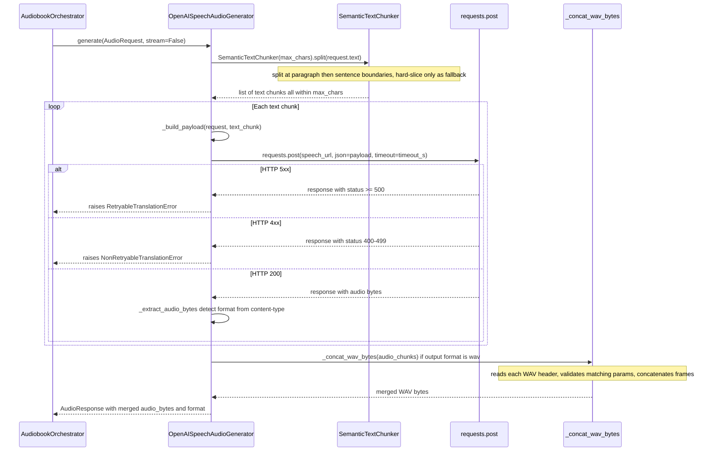

**Step-by-step walkthrough:**

- **`Orch → Gen: generate(AudioRequest, stream=False)`** — The orchestrator passes the full
  `AudioRequest` including model, text (already cleaned by `_strip_inline_tags_for_tts`), voice,
  and narration instructions built by `_instruction_for_block`.
- **`Gen → Chunker: split(request.text)`** — `SemanticTextChunker(max_chars=self.max_chars_per_request)`
  is called. The default `max_chars_per_request` is 3900, providing a small safety margin below
  most backends' hard limit of 4096 characters.
- **`Chunker: paragraph split first`** — The text is split by two or more consecutive newlines into
  paragraph units. If two adjacent paragraphs fit together within `max_chars`, they are merged into
  a single chunk. This avoids unnecessary network requests for books with short paragraphs.
- **`Chunker: sentence split fallback`** — If a single paragraph exceeds `max_chars`, it is split
  at sentence boundaries (`(?<=[.!?…])\s+`). Sentences are packed greedily into chunks under the
  limit.
- **`Chunker: hard slice last resort`** — If a single sentence exceeds `max_chars`, `_slice_long_text`
  slices it into fixed-size pieces. This handles unusual inputs like long unbroken strings.
- **`Gen: _build_payload(request, text_chunk)`** — Constructs the JSON body for the `/v1/audio/speech`
  endpoint. The `voice` and `instructions` fields are included only when non-empty, matching the
  schema expected by Kokoro-FastAPI, Orpheus-FastAPI, and similar backends.
- **`Gen → HTTP: requests.post(...)`** — Uses `requests.post` with a generous `timeout_s` (default
  6000 seconds) to accommodate large text inputs on slow local hardware. `stream=True` uses
  chunked transfer; `stream=False` (the default) reads the entire response body at once.
- **`HTTP → Gen: HTTP 5xx`** — `_validate_response` maps status `>= 500` to
  `RetryableTranslationError`, which the orchestrator's `_process_chapter` re-raises. The error
  taxonomy preserves the signal that this failure is transient.
- **`HTTP → Gen: HTTP 4xx`** — Status 400–499 maps to `NonRetryableTranslationError`. A 400 most
  likely indicates an unsupported model name or malformed request; retrying would not help.
- **`HTTP → Gen: HTTP 200`** — `_extract_audio_bytes` reads the response. In streaming mode,
  `resp.iter_content(chunk_size=8192)` is consumed and concatenated. In non-streaming mode,
  `bytes(resp.content)` is used with an explicit cast to satisfy mypy's strict `no-any-return` rule.
- **`Gen: _detect_output_format`** — The `content-type` header is inspected for `"mpeg"` or `"mp3"`;
  anything else is treated as WAV. This allows the generator to work correctly with backends that
  return MP3 when that format is requested via `response_format`.
- **`Gen → WAV: _concat_wav_bytes(audio_chunks)`** — For WAV output, each chunk's RIFF header is
  read with the stdlib `wave` module. The first chunk's parameters (channels, sample width, frame
  rate, compression type) are recorded. Subsequent chunks must match; mismatched parameters raise
  `RetryableTranslationError` because this indicates a server-side inconsistency that may resolve on
  retry. All PCM frames are concatenated and a new RIFF header is written for the combined output.
- **`Gen → Orch: AudioResponse`** — Returns the merged audio bytes and the detected format string.
  The orchestrator writes the bytes to a chunk file named `chunk_<N>.<format>`.

---

## 5. Progress Checkpointing Flow

`ProgressIndex` provides thread-safe, crash-resistant progress persistence. Every write is atomic:
a `.tmp` file is written and then renamed to the final path. On POSIX filesystems a rename within
the same directory is atomic, which means the progress file is never left in a partially-written
state regardless of when the process is killed. Multiple chapter workers share one `ProgressIndex`
instance; the `Lock` field serialises all reads and writes to prevent JSON corruption under
concurrent access.

The resume algorithm is deliberately conservative: it takes the maximum of the stored
`completed_blocks` value and the actual count of contiguous chunk files present on disk. This
means that if the index is reset or lost but chunk files are still present, the synthesis loop
resumes from the correct position. Conversely, if chunk files are missing but the index is intact,
the index is used. The orphaned chunks in the latter case will be overwritten by new synthesis.

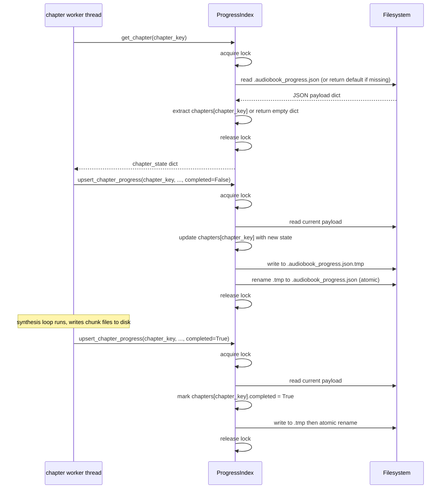

**Step-by-step walkthrough:**

- **`Worker → Idx: get_chapter(chapter_key)`** — Called during `_prepare_chapter` to check whether
  this chapter was already completed in a prior run. The `chapter_key` is the EPUB internal path
  string (e.g. `OEBPS/ch1.xhtml`), which is stable across runs for the same EPUB file.
- **`Idx: acquire lock`** — The `Lock` is a `threading.Lock` stored as a dataclass field. Although
  `ProgressIndex` is a frozen dataclass (preventing reassignment of `path` and `lock`), the lock
  itself can still be acquired and released — freezing prevents field mutation, not method invocation.
- **`Idx → FS: read JSON`** — `_load_unlocked` reads the file and parses it. If the file is absent
  (first run), a default `{"version": 1, "chapters": {}}` is returned. If the JSON is malformed
  (e.g. interrupted write before the atomic rename fixed by a `.tmp` leftover), the same default is
  returned after a WARNING log. The `version` field is reserved for future schema migrations.
- **`Idx → Worker: chapter_state dict`** — A shallow copy of the chapter's state dict is returned
  to prevent the caller from accidentally mutating the parsed payload.
- **`Worker → Idx: upsert_chapter_progress(..., completed=False)`** — Called twice per chapter: once
  immediately before synthesis begins (to register the chapter in the index) and once after each
  paragraph chunk is written. The `completed_blocks` count advances monotonically.
- **`Idx → FS: atomic write`** — `_save_unlocked` writes the serialised payload to a `.tmp` path
  using `Path.write_text`, then calls `Path.replace(self.path)` (Python's cross-platform atomic
  rename). The `sort_keys=True` option ensures deterministic JSON serialisation for easier diffing
  during debugging.
- **`Worker → Idx: upsert_chapter_progress(..., completed=True)`** — Called after `merge_temp_chunks`
  returns successfully and the temp directory is deleted. Setting `completed=True` means the next
  run will detect the chapter as done and skip it, provided the output file also exists on disk.

---

## 6. Audio Merge Flow

`merge_temp_chunks` in `application/merge.py` assembles the per-paragraph chunk files produced by
the synthesis loop into a single chapter audio file. The merger uses pydub to load each chunk,
appends configurable silence between consecutive paragraph-like blocks, and exports the combined
`AudioSegment` to the output path. Silence is not inserted between a heading and the block that
immediately follows it, matching natural audiobook narration where a chapter title is read without
a gap before the body text.

The `_collect_block_audio_files` helper validates that every expected chunk file is present on disk
before the merge begins. This pre-merge check raises `RuntimeError` for the first missing index,
which propagates up through `_finalize_chapter` and is caught and wrapped in `AudiobookGeneratorError`
by `_process_chapter`. This design prevents a silent truncation of the chapter audio if a chunk was
never synthesised.

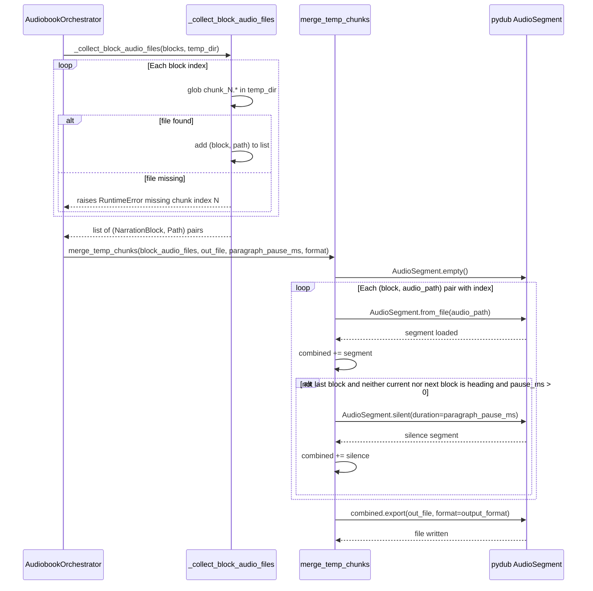

**Step-by-step walkthrough:**

- **`Orch → Collect: _collect_block_audio_files(blocks, temp_dir)`** — Iterates `blocks` with
  `enumerate(start=1)` to resolve the expected file path for each paragraph index. The glob pattern
  `chunk_<N>.*` handles any audio format extension returned by the TTS backend.
- **`Collect: glob chunk_N.*`** — `sorted(temp_dir.glob(f"chunk_{paragraph_index}.*"))` returns
  matches in lexicographic order. The first match is used, ensuring deterministic behaviour when (in
  theory) multiple format variants of the same chunk exist.
- **`Collect: raises RuntimeError for missing chunk`** — The error message names the first missing
  index so debugging is fast. `RuntimeError` is used here rather than a domain error because missing
  chunks represent an internal consistency failure, not an external input failure. The orchestrator's
  `_process_chapter` wraps it in `AudiobookGeneratorError` for uniform error reporting.
- **`Merge: AudioSegment.empty()`** — Starts with a zero-length, zero-channel segment. pydub's `+=`
  operator concatenates audio correctly even when the accumulator starts empty.
- **`Merge: pause insertion logic`** — The pause is inserted only when all three conditions hold:
  (1) the current block is not the last, (2) neither the current block nor the immediately following
  block is a heading, and (3) `paragraph_pause_ms > 0`. Headings in EPUB are often short titles
  that should be followed immediately by the first paragraph of the section, matching how human
  narrators read audiobooks.
- **`Merge → pydub: combined.export(...)`** — pydub delegates to ffmpeg for encoding. The `format`
  parameter is either `"wav"` or `"mp3"`, matching the TTS server's output format. If ffmpeg is not
  installed on the system, MP3 export will fail with a pydub error; this is an infrastructure
  dependency documented in the project README.

---

## 7. Class Diagram — Domain Models

The domain layer holds pure value objects with no external dependencies. Every class is a frozen
dataclass, making them safe to share across concurrent chapter workers without defensive copying.
`ChapterDocument` is the raw EPUB chapter payload — just a path string and raw bytes. `AudioSettings`
captures the full runtime configuration for one generation run; its `base_url` field defaults to
`_DEFAULT_TTS_BASE_URL` from `domain/constants.py`, ensuring that `AudioSettings()`, the CLI, and
`OpenAISpeechAudioGenerator` all agree on the same default without any one of them owning the value.
`AudioRequest` and `AudioResponse` are the per-paragraph TTS request and response envelopes.

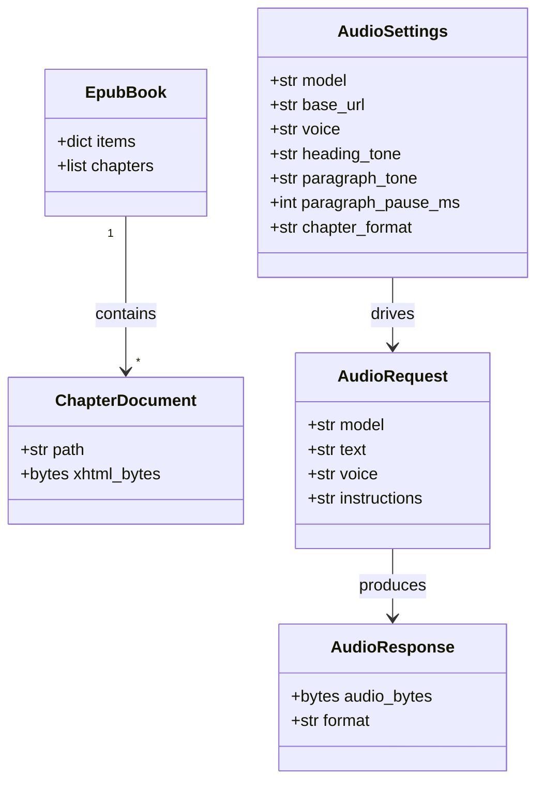

---

## 8. Class Diagram — Ports (Interfaces)

Ports are Python `Protocol` classes that define the contract each infrastructure adapter must
satisfy. Because they are structural protocols (duck typing), no inheritance is required — any class
that provides the correct method signatures satisfies the port. This allows `FakeRepo` and
`FakeAudio` in the test suite to satisfy the ports without importing or subclassing anything from
infrastructure, keeping the unit tests completely decoupled from all HTTP and file-system concerns.
`EpubBook` is co-located in `ports.py` because it is the return type of `EpubRepositoryPort.load()`
and is logically part of the port's contract rather than a standalone domain model.

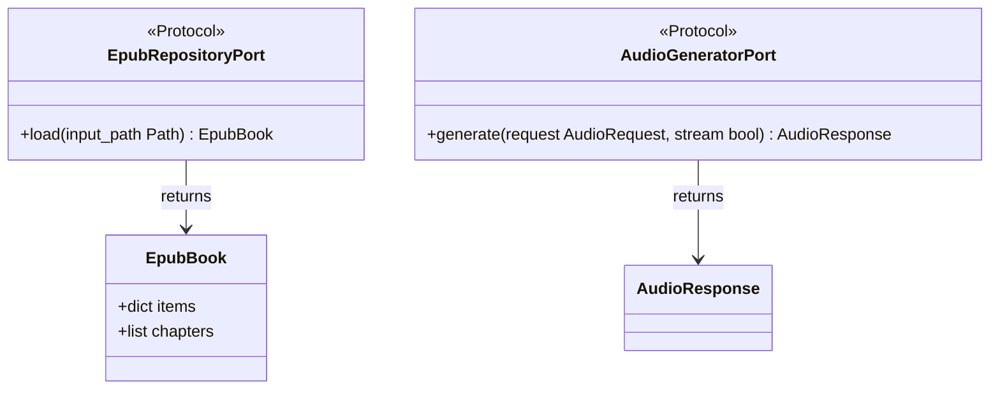

---

## 9. Class Diagram — Infrastructure Adapters

Infrastructure adapters are the concrete implementations behind the ports. `ZipEpubRepository`
reads ZIP archives and filters XHTML entries for the chapters list; it deliberately does not
implement `save()` because the application never writes EPUBs back — this is an audiobook generator,
not a translator. `OpenAISpeechAudioGenerator` drives the HTTP conversation with any
`/v1/audio/speech`-compatible TTS backend. `SemanticTextChunker` lives in the same module as
`OpenAISpeechAudioGenerator` because it is a pure utility for splitting text before sending it to
the TTS API; it has no infrastructure dependencies of its own and its `max_chars` parameter is set
from the generator's `max_chars_per_request` field.

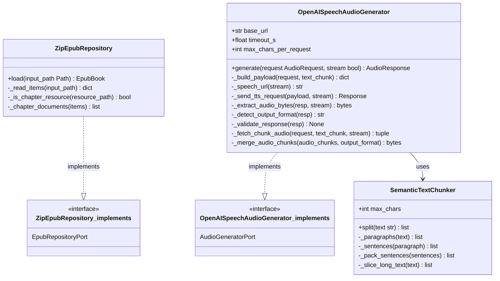

---

## 10. Class Diagram — Application Layer

The application layer contains the orchestrator and five supporting modules: `models`, `progress`,
`text`, `merge`, and `services`. Each module has a single cohesive responsibility. `AudiobookOrchestrator`
depends only on domain ports and the four supporting modules; it has no direct import from
`infrastructure`. `ProgressIndex` is a frozen dataclass that holds mutable state indirectly through
a `Lock` and a file path — the freeze prevents accidental reassignment of these fields but does not
prevent the lock from being used or the file from being written. `NarrationBlock`, `ChapterJob`, and
`PreparedChapter` are immutable value objects that carry the inputs for each stage of the chapter
pipeline.

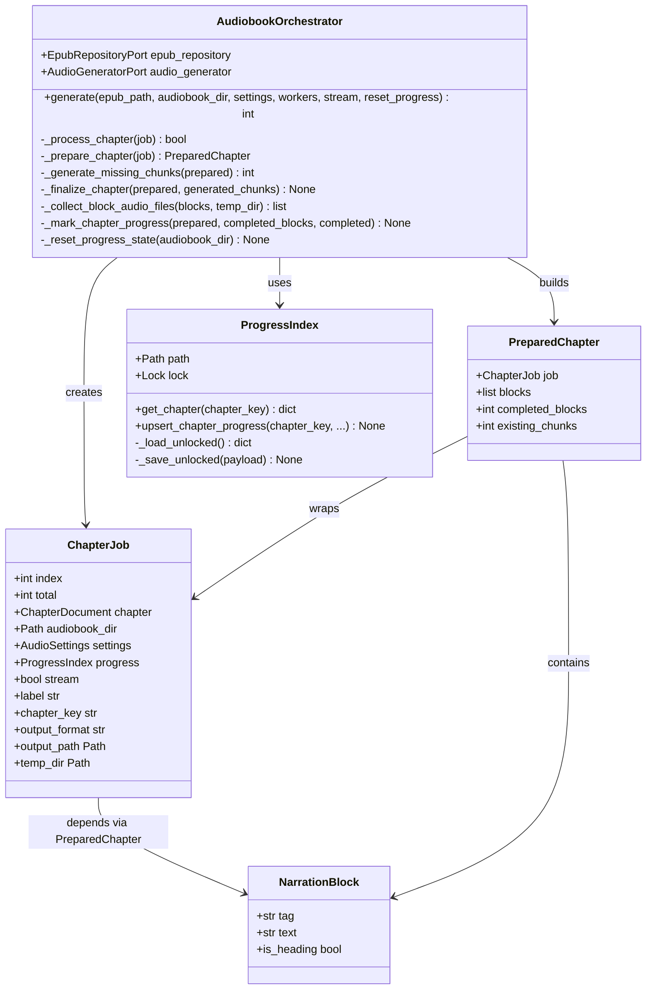

---

## 11. Error Hierarchy

There are two main branches in the error hierarchy. `EpubReadError` wraps any exception that occurs
during ZIP archive I/O or XHTML parsing — both are treated as corrupt input errors rather than
infrastructure errors, since the EPUB format is the domain the application reads. `AudioGenerationError`
covers failures from the TTS adapter: `RetryableTranslationError` covers transient errors (network
failures, TTS server 5xx responses, incompatible WAV parameters returned by concurrent chunk
requests, and empty responses) while `NonRetryableTranslationError` covers permanent client-side
failures (400-level responses, malformed requests). `ValidationError` is reserved for input
validation failures detected before any external I/O begins.

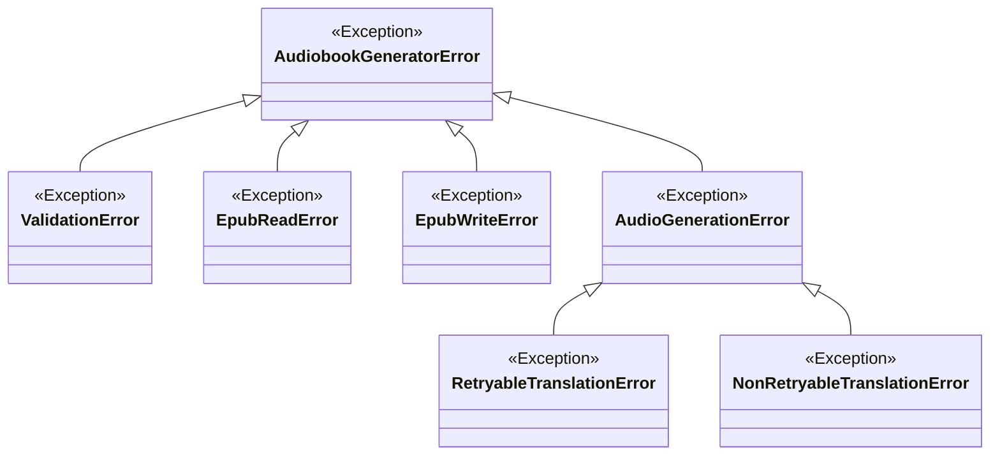

---

## 12. Data Flow Summary

```
[EPUB file on disk]
    │
    ▼ ZipEpubRepository.load()
    │   open ZIP archive, read all members into dict[path → bytes]
    │   filter XHTML/HTML entries into ChapterDocument list
    │
[EpubBook]
    │   items: dict[archive_path → bytes]
    │   chapters: [ChapterDocument, ...]
    │
    ▼ AudiobookOrchestrator.generate()
    │   create ProgressIndex (shared across all workers)
    │   submit all ChapterJob values to ThreadPoolExecutor
    │
    ▼ Per-chapter: _process_chapter(ChapterJob)
    │
    │   persist raw XHTML bytes to .chapters/chapter_N.xml
    │
    │   extract_narration_blocks(xhtml_bytes)
    │   ├── lxml etree.fromstring → root Element
    │   ├── iter all elements → filter by _NARRATABLE_TAGS
    │   ├── _normalise_block_text → clean display text per element
    │   ├── filter to spoken elements (contain alnum chars)
    │   └── build NarrationBlock list (append period to headings)
    │
    │   check ProgressIndex for prior completed state
    │   count contiguous chunk files from disk
    │   resume cursor = max(stored_progress, existing_chunks)
    │
    ▼ Per-paragraph synthesis loop
    │
    │   _strip_inline_tags_for_tts(block.text) → clean TTS input
    │   _instruction_for_block(block, settings)  → narration style instructions
    │   AudioGeneratorPort.generate(AudioRequest)
    │       │
    │       │   SemanticTextChunker.split(text, max_chars)
    │       │   ├── paragraph-boundary split
    │       │   ├── sentence-boundary pack
    │       │   └── hard slice as last resort
    │       │
    │       │   POST /v1/audio/speech per chunk
    │       │   _concat_wav_bytes (frame-level merge for WAV)
    │       │
    │       └── AudioResponse(audio_bytes, format)
    │
    │   write chunk_N.<format> to .audio_chunks/chapter_N_<stem>/
    │   ProgressIndex.upsert_chapter_progress (atomic JSON write)
    │
    ▼ merge_temp_chunks(block_audio_files, out_file, pause_ms, format)
    │   pydub.AudioSegment.from_file per chunk
    │   insert AudioSegment.silent(paragraph_pause_ms) between para blocks
    │   combined.export(out_file, format=format)
    │
    ▼ cleanup temp dir + mark ProgressIndex completed=True
    │
[per-chapter audio file: <audiobook_dir>/<chapter_stem>.<format>]
[progress index: <audiobook_dir>/.audiobook_progress.json]
```

---

## 13. Key Design Decisions

| Decision | Rationale |
|---|---|
| Frozen dataclasses throughout domain and application | Immutability makes all value objects safe to share across the chapter thread pool without defensive copying, and catches accidental mutation at type-check time under mypy strict mode |
| Composition root in main.py, not in cli.py | cli.py can be tested without importing any infrastructure module; injecting a FakeRepo and FakeAudio into the orchestrator is sufficient to unit-test the full command handler |
| ProgressIndex as a frozen dataclass with a Lock field | Freezing prevents reassignment of path and lock after construction while still allowing the lock to be acquired and released, giving thread-safety guarantees without introducing a mutable wrapper class |
| Raise EpubReadError on XMLSyntaxError rather than returning empty list | A corrupt chapter XHTML must fail loudly: silently returning no blocks would cause the orchestrator to skip the chapter without any error signal, leaving the user with an incomplete audiobook and no diagnostic |
| Re-raise AudiobookGeneratorError subclasses, wrap all other exceptions | _process_chapter must not swallow RetryableTranslationError or NonRetryableTranslationError because these carry the retry/no-retry signal; wrapping unknown exceptions in AudiobookGeneratorError ensures every failure reaches the caller as a domain error with a meaningful message |
| Single _DEFAULT_TTS_BASE_URL constant in domain/constants.py | Three separate default URL strings across AudioSettings, OpenAISpeechAudioGenerator, and _resolve_tts_url would disagree silently when any one is updated; one constant eliminates the divergence entirely |
| SemanticTextChunker splits at paragraph then sentence boundaries | Sending mid-sentence text fragments to TTS produces unnatural prosody; respecting paragraph and sentence structure ensures the TTS engine can apply correct stress and intonation even when the text must be split across multiple requests |
| Per-paragraph chunk files with contiguous-gap detection | If the process is killed after writing chunk_2.wav but before writing chunk_3.wav, counting contiguous chunks from index 1 correctly resumes at paragraph 3 rather than over-counting based on total file count |
| Atomic .tmp rename for progress index writes | A POSIX rename within the same directory is atomic; the progress file is never left in a partially-written state regardless of when the process is killed, preventing JSON corruption that would reset the resume cursor to zero |
| Chapter-level parallelism, sequential paragraphs within a chapter | Chapters can be synthesised independently in parallel; paragraphs within a chapter must be sequential to maintain a correct, gap-free chunk numbering scheme required by the contiguous-gap resume algorithm |